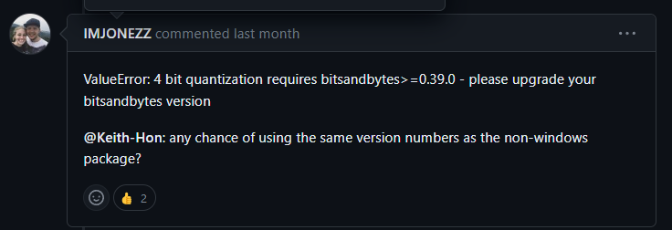

# Error1

> undefined symbol: cget_col_row_stats


# Solution

```bash
$ cd {ENV}/lib/python-3.10/site-packages/bitsandbytes
$ cp libbitsandbytes_cuda118.so libbitsandbytes_cpu.so
```

- cuda 버전에 맞게 파일을 복사해주면 됨

# Error2

> no gpu detected! check your cuda paths. proceeding to load cpu-only library...

- 갑자기 GPU를 인식 못함

# Solution


```
$ pip install bitsandbytes --upgrade
```

- 버젼 업데이터로 해결

# Ref

[#156](https://github.com/TimDettmers/bitsandbytes/issues/156)